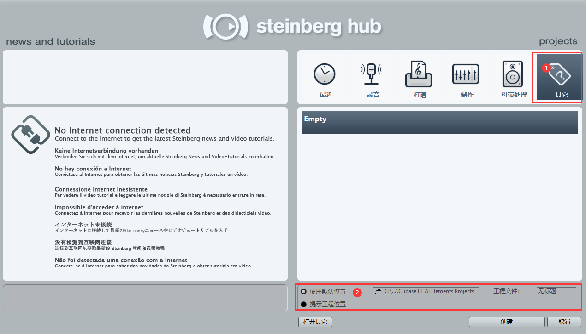
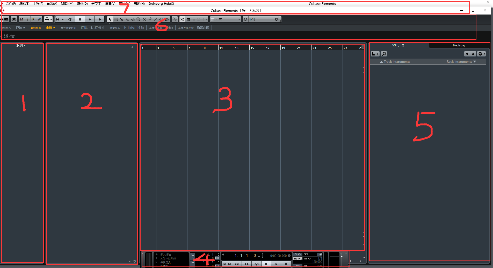

# Cubase入门教程

## 界面认识

最左边的区域是“观测区"，单轨音量调节，效果器插入，备忘记事等等都将在这边进行操作。

中间区域可以进行各类轨道的插入

右边这块最大的界面是我们轨道长度的显示，上方这些数字代表了小节数，鼠标右击，选择秒，也可以调整到时间刻度。我们可以点击鼠标左键，将播放指针召唤到你鼠标所在的小节线位置，按键盘空格键进行指针播放，如果这时候有MIDI轨或者音频轨，那指针经过的地方都将转换成声音读取出来。

最底下的是“走带控制器”，这个在下文会单独讲解。

上面这一栏是工具栏，也是我们之后会经常使用的一栏。

最上面的和很多软件一样，便是菜单栏。一些功能设置的界面都将通过菜单栏召唤出来。

## 添加音频轨

在轨道插入区域，右击，选择“添加音频轨”

## 音频的裁剪与还原

**方法一**：工具栏“剪刀”

